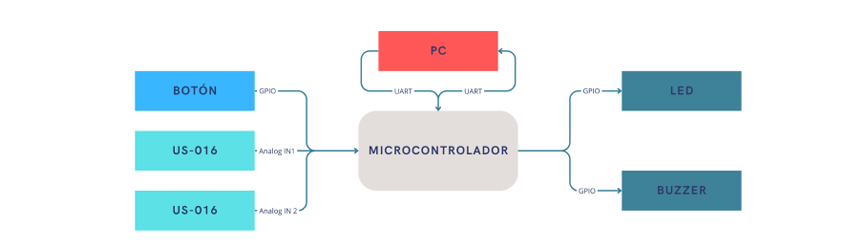

## Descripción del TP N°1

- **Título:** Dispositivo de monitoreo de aforo de personas
- **Alumno:** Dax Alonso Collas Maldonado
- **Objetivo:** Desarrollar un dispositivo capaz de contabilizar el número de personas en un local comercial y alertar cuando se exceda el aforo máximo.
  
### Descripción

El dispositivo utiliza dos sensores ultrasónicos US-016 ubicados en el ingreso del local para contabilizar el ingreso y salida de personas, utilizando la siguiente lógica:

1. **Entrada completa:** Si una persona activa primero el sensor de entrada US-016 (IN 1) y luego el sensor de salida US-016 (IN 2), se cuenta como una persona que ha ingresado.
   
2. **Salida completa:** Si una persona activa primero el sensor de salida US-016 (IN 2) y luego el sensor de entrada US-016 (IN 1), se cuenta como una persona que ha salido.
   
3. **Entrada incompleta:** Si una persona activa el sensor de entrada US-016 (IN 1) pero no activa el siguiente sensor US-016 (IN 2), no se contabiliza como una entrada.
   
4. **Salida incompleta:** Si una persona activa el sensor de salida US-016 (IN 2) pero no activa el siguiente sensor US-016 (IN 1), no se contabiliza como una salida.

El supervisor establece el aforo máximo desde la PC al microcontrolador mediante el puerto serial. El microcontrolador informa continuamente la cantidad actual de personas dentro del local a través del puerto serie. Cada vez que alguien entra o sale, el microcontrolador envía una actualización indicando el número actual de personas y si fue un ingreso o una salida. Si la cantidad de personas excede el aforo máximo, el microcontrolador notifica a la PC mediante el puerto serie y activa una alerta visual con un LED parpadeante y una alerta auditiva mediante un buzzer. El supervisor puede detener esta alerta presionando un botón.

### Observaciones

Los sensores deben estar colocados al menos a un metro de distancia del suelo. Además, se asume que el dispositivo se empleará en locales que cuenten con una sola entrada.

### Plataforma de desarrollo

- **Plataforma:** NUCLEO-F411RE

### Periféricos a utilizar

- Botón: Para detener la alerta de exceso de aforo.
- Buzzer: Se encenderá y apagará intermitentemente para indicar que se excedió el aforo.
- LED: Se encenderá y apagará intermitentemente para indicar que se excedió el aforo.
- US-016 (IN 1): Sensor para detectar personas que desean ingresar.
- US-016 (IN 2): Sensor para detectar personas que desean salir.
- UART: Facilita la configuración del aforo máximo desde la PC al dispositivo y permite al microcontrolador enviar actualizaciones del aforo actual a la PC.

### Diagrama de bloques

### Referencias y Recursos

- [A Beginner’s Guide to Designing Embedded System Applications on Arm Cortex-M Microcontrollers](https://www.arm.com/resources/education/books/designing-embedded-systems)
- [Microcontrolador NUCLEO-F411RE](https://os.mbed.com/platforms/ST-Nucleo-F411RE/)
- [Sensor US-016](https://psc.byu.edu/00000188-b093-d15f-a7cc-fcf317d70001/ultrasonic-distance-sensor-analog)
- [Documentación del sensor US-016 en Slideshare](https://es.slideshare.net/slideshow/sensor-ultrasonico-88343310/88343310)
